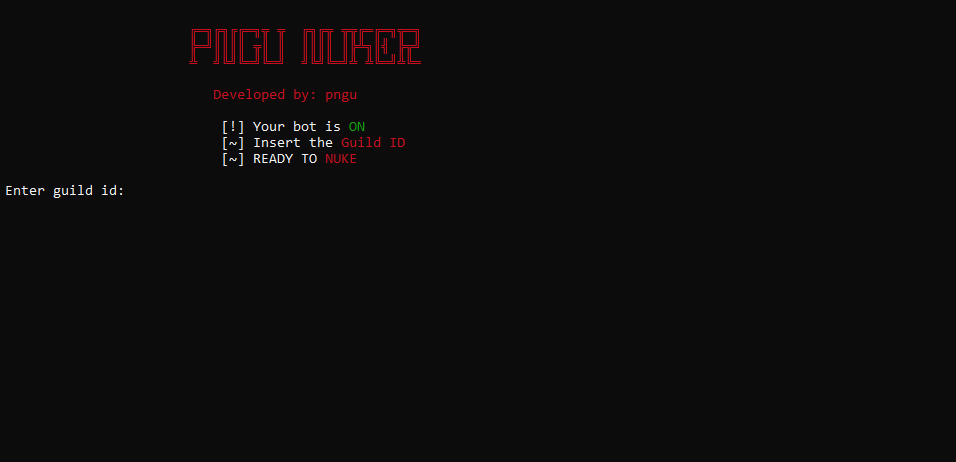

<p align="center">
<h3 align="center">Multifunctional bot for destroying discord servers</h3>
</p>

<details>
    <summary>Contents</summary>
    <ol>
        <li>
            <a href="#about-pngu-nuk3r">About the Project</a>
        </li>
        <li>
            <a href="#getting-started">Getting Started</a>
            <ul>
                <li><a href="#prerequisites">Prerequisites</a></li>
                <ul>
                    <li><a href="#how-to-create-a-bot-account">How to Create a Bot Account</a></li>
                    <li><a href="#how-to-enable-intents">How to enable intents</a></li>
                </ul>
                <li><a href="#installation">Installation</a></li>
            </ul>
        </li>
        <li><a href="#usage">Usage</a></li>
    </ol>
</details>

## About Pngu Nuk3r



Pngu Nuk3r is a versatile and comprehensive bot designed for dismantling Discord servers.

<p align="right">(<a href="#top">back to top</a>)</p>

## Getting Started
To get a working local copy, follow these simple steps.

### Prerequisites
1. To get started, first install Python. You can download it from [here](https://www.python.org).
2. Next, you'll need a Discord bot account with intents enabled.

### How to Create a Bot Account:
1. Begin by logging in to the [Discord website](https://discord.com).
2. Head to the [application page](https://discord.com/developers/applications).
3. Click the "New Application" button.
4. Give your application a name, then click "Create".
5. To create a Bot User, go to the "Bot" tab and click "Add Bot".
- Select "Yes, do it!" to proceed.
6. If you want others to invite your bot, check the **Public Bot** option. Leaving it unchecked restricts invitations to
you.
- Ensure **Require OAuth2 Code Grant** remains unchecked.
7. Use the "Copy" button to save your bot's token.

### How to Enable Intents:
1. Go back to the [application page](https://discord.com/developers/applications).
2. Select the bot you want to enable intents for.
3. Navigate to the bot tab on the left.
4. In the "Privileged Gateway Intents" section, enable all privileged intents, then save your changes.

### Installation
Or you can follow next steps:
1. Clone the repo
```sh
git clone https://github.com/ThatzPingu/PnguNuk3r
```
2. Move to the source directory:
```sh
cd PnguNuk3r
```
<p align="right">(<a href="#top">back to top</a>)</p>

## Usage
Run the `main.py` file by using `py -3 main.py`, or execute `start.bat`.
Upon the initial launch, the bot will prompt you for:
1. Guild id 
2. Token to insert in `config.py`

<p align="right">(<a href="#top">back to top</a>)</p>